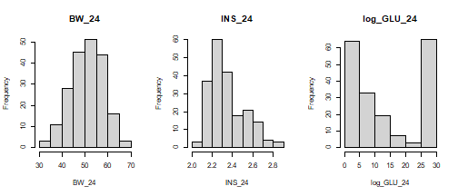
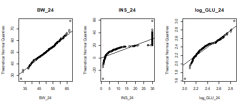
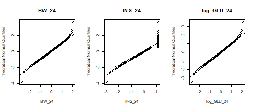
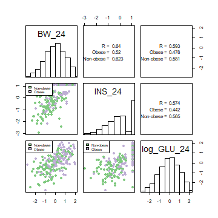

## Abstract

Here we present an update of the R package for the Combined Analysis of Epistasis 
and Pleiotropy, or `cape`. This package implements a method, originally described
in @Carter:2012fd, that infers directed interaction networks between genetic 
variants for predicting the influence of genetic perturbations on quantitative
traits. This method takes advantage of complementary information in partially 
pleiotropic genetic variants to resolve directional influences between variants 
that interact epistatically. `cape` can be applied to a variety of genetic variants, 
such as single nucleotide polymorphisms (SNPs), copy number variations (CNVs) 
or structural variations (SVs). Here we demonstrate the functionality of `cape` 
by inferring a predictive network between quantitative trait loci (QTL) in a 
cross between the non-obese, non-diabetic (NON) mouse and the New Zealand obese 
(NZO) mouse [@Reifsnyder:2000is].

## Installing and Loading cape
To install cape use:


```r
install.packages("cape")
```

After installation load cape with the following command:


## Loading Data
The current version of cape recognizes data in multiple formats: R/qtl, 
R/qtl2, and PLINK.

### Loading data formatted for qtl
In addition to supporting the newer R/qtl2 (@broman2019r) format, we also support 
the R/qtl (@rqtl) csv format for cape. You can learn more about this format
at the [R/qtl website](https://rqtl.org). Briefly, this format 
contains all traits and genotypes in one comma-delimited file.
The first few columns contain traits, covariates, and indvidual identifiers,
and the remaining contain genotypes. Please see the qtl demo data included 
with cape for an example. Also see `?read_population` for more details. 

To read in data with this format, we use `read_population`, followed
by `cape2mpp`, which updates the object to the newer cape format.

The following code is from the demo_qtl example.


```r
results_path <- here("demo", "demo_qtl")
data_path <- here("tests", "testthat", "testdata", "demo_qtl_data")
data_file <- file.path(data_path, "NON_NZO_Reifsnyder_pgm_CAPE_num.csv")
param_file <- file.path(results_path, "NON_NZO.parameters.yml")

cross <- read_population(data_file)
```

```
## The genotypes are encoded as 0, 1, 2.
## Converting to 0, 0.5, 1.
## 
## Removing markers on the X chromosomeMissing values detected in the genotype matrix.
## 	If you are planning to use the kinship correction, please use impute.geno() to impute the genotype data.
## Read in the following data:
## 	- 208 individuals -
## 	- 84 markers -
## 	- 8 phenotypes -
```

```r
cross_obj <- cape2mpp(cross)
obesity_cross <- cross_obj$data_obj
obesity_geno <- cross_obj$geno_obj$geno
```

### Loading data formatted for qtl2
Many researchers are now using the updated [R/qtl2](https://kbroman.org/qtl2/)
(@broman2019r), and we also provide ways to handle data in this format. If you are 
not familiar with qtl2, we highly recommend reading about it and testing it out. 
R/qtl2 is the definitive genetic mapping package, and the outstanding 
documentation can answer many basic questions about genetic mapping.  

The following code shows how to access remote example data provided by Karl Broman
for the qtl2 package. For both accessing remote data, or local data, we use 
the `read_cross2` function from qtl2 to read in the data, and then `qtl2_to_cape`
to convert the qtl2 object to a cape object.


```r
iron_qtl2 <- read_cross2("https://kbroman.org/qtl2/assets/sampledata/iron/iron.yaml")

iron_cape <- qtl2_to_cape(cross = iron_qtl2)
data_obj <- iron_cape$data_obj
geno_obj <- iron_cape$geno_obj 
```

### Loading data formatted for PLINK
Completely new to this version of cape is the ability to load files formatted
for PLINK (@purcell2007plink). This enables broader use of cape by researchers 
who are interested in studying genetic interactions in human cohorts.

We have provided example data with the cape demo_plink. Please see the 
[PLINK website](https://zzz.bwh.harvard.edu/plink/index.shtml) for more
information about PLINK and formatting data for PLINK.

For cape, we require a ped file, a map file, and a phenotype file. PLINK 
standard format includes only one trait, and cape requires at least two
traits. We therefore need the phenotype file in the pheno.txt format
as described [here](https://zzz.bwh.harvard.edu/plink/data.shtml#pheno).

To generate the data for the demo included in cape, we downloaded 
example PLINK [hapmap data](http://zzz.bwh.harvard.edu/plink/hapmap1.zip).

To reduce the size of the data set for demonstration purposes, we sampled 
1000 the SNPs in the data set using PLINK:

./plink --file hapmap1 --make-bed --thin-count 1000 --recode --out test

We generated two random, normally distributed phenotypes for the 
phenotype file. These are not particularly interesting, but they 
do demonstrate what the files should look like.

The following code shows how to read in PLINK data, use the function 
`plink2cape` to read in the map, ped, and phenotype files.

This code is also included in demo_PLINK.R, which is included with cape.


```r
data_path <- here("tests", "testthat", "testdata")
ped <- file.path(data_path, "test.ped")
map <- file.path(data_path, "test.map")
pheno <- file.path(data_path, "test.pheno")
out <- file.path(data_path, "test.csv")
param_file <- file.path(results_path, "plink.parameters.yml")

cross_obj <- plink2cape(ped, map, pheno, out = "out.csv")

data_obj <- cross_obj$data_obj
geno_obj <- cross_obj$geno_obj$geno
```

### Getting started with an example

In this vignette, we will reanalyze a data set described in @Reifsnyder:2000is. 
This experiment was performed to identify quantitative trait loci (QTL) for 
obesity and other risk factors of type II diabetes in a reciprocal 
back-cross of non-obese non-diabetic NON/Lt mice and the diabetes-prone, New 
Zealand obese (NZO/HILt) mice. The study found multiple main-effect QTL 
influencing phenotypes associated with diabetes and obesity as well as multiple 
epistatic interactions. In addition, maternal environment (i.e. whether the mother 
was obese) was found to interact with several markers and epistatic pairs 
to influence the risk of obesity and diabetes of the offspring. The complex nature 
of diabetes and obesity, along with their complex and polygenic inheritance 
patterns, make this data set ideal for an analysis of epistasis and pleiotropy.

Included in this dataset are 204 male mice genotyped at 85 MIT markers
across the genome. The phenotypes included are the body weight (g), 
insulin levels (ng/mL), and the log of plasma glucose levels (mg/dL), 
all measured at age 24 weeks. In addition, there is a variable 
called ``pgm'' indicating whether the mother of each mouse was normal 
weight (0) or obese (1). 

These data can be accessed through the demo_qtl demonstration code.

## Data visualization
Before proceeding with an analysis we recommend exploring the data visually.
cape provides a few basic functions for looking at distributions of traits and
the correlations between traits.  

The figure below shows distributions of three traits: body weight at 24 weeks
(BW_24), serum insulin levels (INS_24), and the log of serum glucose levels
(log_GLU_24). We have selected these traits out of all traits included in
the data set by using the `pheno_which` argument. Leaving this argument
as NULL includes all traits in the plot.


```r
hist_pheno(obesity_cross, pheno_which = c("BW_24", "INS_24", "log_GLU_24"))
```



Body weight looks relatively normally distributed, but glucose and insulin have
obviously non-normal distributions. We can see this in a different way by 
looking at the Qnorm plots for each trait using `qnorm_pheno.'


```r
qnorm_pheno(obesity_cross, pheno_which = c("BW_24", "INS_24", "log_GLU_24"))
```



In general we recommend mean centering and normalizing all traits before
proceeding with the analysis. Trait normalization can be achieved through log 
transformation, quantile normalization, or another method before the analysis. 
The function `norm_pheno` uses quantile normalization to fit the 
phenotypes to a normal distribution. Briefly, this process ranks the trait
values and divides by n-1. It then returns the quantiles of the normal 
distribution using `qnorm.` Mean centering subtracts the mean value 
from each trait, and standardizing divides by the standard deviation.


```r
obesity_cross <- norm_pheno(obesity_cross, mean_center = TRUE)
```

Now when we plot the distributions compared to a theoretical normal distribution,
we see that our traits are much closer to normally distributed. Insulin still has
a ceiling effect, which cannot be removed by normalization because rank cannot 
be determined among equal values.


```r
qnorm_pheno(obesity_cross, pheno_which = c("BW_24", "INS_24", "log_GLU_24"))
```



## A Note on Trait Selection

Cape relies on the selection of two or more traits that have common 
genetic factors but are not identical across all individuals. One indirect
way at getting at this is through trait correlation. Traits that are modestly
correlated may have both common and divergent contributing genetic factors.
This is in contrast to traits that are perfectly correlated and likely have
only common genetic influences, and to traits that are completely uncorrelated
and likely have divergent genetic influences.

We can look at the correlation of the traits in our data set using `plotPhenoCor.`
The figure below shows the correlations between all pairs of traits. Here,
we have also colored the points by the covariate "pgm" to look for some
initial trends. You can see that mice with obese mothers tended to have
higher body weight, insulin levels, and glucose levels.

The lower triangle of panels in the figure below shows the point clouds
of each pair of traits plotted against each other. The diagonal shows 
the distribution of each individual trait, and the upper triangle 
gives numeric information about pairwise correlations. If `color_by`
is not specified, only the overall pearson R values are shown for each
trait pair. If `color_by` is specified, we show the overall correlation
as well as correlations for each group in `color_by.`


```r
plotPhenoCor(obesity_cross, pheno_which = c("BW_24", "INS_24", "log_GLU_24"),
color_by = "pgm", group_labels = c("Non-obese", "Obese"))
```



The traits in this data set are all modestly correlated, which is ideal for cape.
In addition, we have selected traits from a range of physiological levels. 
Body weight is a high-level physiological trait, whereas glucose and insulin
levels are endophenotypes measured at the molecular level. 

Cape measures interactions between pairs of genes across all traits 
with the assumption that different genetic interactions identified 
for a single gene pair in the context of different phenotypes represent 
multiple manifestations of a single underlying gene network. By measuring 
the interactions between genetic variants in different contexts we can gain 
a clearer picture of the network underlying statistical epistasis 
[@Carter:2012fd].

## Specifying cape parameters

Before starting a cape run, we need to specify all the parameters for
the run in a parameter file. We use a .yml file for these parameters. 
A .yml file holds information easily readable to both humans and computers.
We have multiple examples of cape parameter files in the demo folder associated
with the cape package. It is probably easiest to start with one of these and
modify it to fit your data. The following sections describe each cape parameter
in the yml file.

### General parameters
The section of general parameters is where we specify which traits we will
use, whether we want cape to normalize the traits for us, and whether we want
cape to save the results. This is also the section in which we tell cape 
whether we want to use a kinship correction or not. kinship corrections are 
discussed futher below.

If a parameter has multiple entries, for example we always want to test
multiple traits, each entry gets its own line starting with a dash.

**traits:** This is where the traits to be scanned are entered. Each
trait is entered on its own line preceded by a dash.

**covariates:** Any covariates are entered here. These are originally part
of the trait matrix and are designated by cape as covariates. Each covariate
specified is included as an additive covariate in each model, and also tested
as an interactive covariate. Here we specify "pgm" as our covariate.

**scan_what:** This parameter refers to whether we will scan individual traits
or composite traits called eigentraits. Eigentraits are calculated by factoring 
the trait matrix by singular value decomposition (SVD):

$$Y = U \cdot V \cdot W^{T}$$

Where $Y$ is a matrix containing one column for each mean-centered, normalized 
phenotype and one row for each individual. If $Y$ contains more individuals 
than phenotypes, the $U$ matrix has the same dimensions as Y with each column 
containing one eigentrait. $V$ contains the singular values, and $W^{T}$ contains 
the right singular vectors in rows. See @Carter:2012fd for more details.

The SVD de-correlates the traits concentrating phenotypic features into 
individual eigentraits. One benefit of this process is that variants that are 
weakly correlated to several traits due to common underlying processes may 
be strongly correlated to one of the eigentraits. This eigentrait captures the 
information of the underlying process, making strong main effects distributed 
between traits easier to detect and identify as potential interaction loci 
and/or covariates.

To specify using individual traits, set `scan_what` to raw_traits.
To specify using eigentraits, set `scan_what` to eigentraits.

**traits scaled:** This is a logical value (true/false) indicating
whether cape should mean center and standardize the traits.

**traits normalized:** This is a logical value indicating whether
cape should normalize the traits. 

**eig_which:** After performing the SVD to create orthogonal eigentraits, you
may whish to analyze only a subset of them in cape. For example, if the first 
two eigentraits capture more than 90\% of the trait variance, you may wish
to discard the last eigentrait. This results in a loss of some information, 
but may increase power to detect important trait-related signals.

To specify which eigentraits to use, enter each on its own line. This is
a bit more tedious than simply entering a number of eigentraits, but offers
a little more flexibility in case you would like to analyze eigentraits that
don't necessarily start at eigentrait 1.

**pval_correction:** This is where we specify the correction for multiple
testing. It can be any of the options in `p.adjust:` "holm", "hochberg", 
"hommel", "bonferroni", "BH", "BY", "fdr", or "none."

**use_kinship:** A logical value indicating whether to use a kinship 
correction.

**pop:** This parameter is only necessary to set if use_kinship is set 
to true. If use_kinship is true, pop can be one of "2PP" for a two-parent
cross, "MPP" for a multi-parent cross, or "RIL" for a recombinant inbred
line. This parameter is passed to `kinship` to inform the calculation of
the kinship matrix.

**save_results:** A logical value indicating whether results should be
written to files. 

**use_saved_results** A logical value indicating whether cape should use
data already written to file. This can be helpful if a job aborts partway
through. You can use everything that has been calculated already and save 
time on the next run. If use_saved_results is true, only results that don't
already exist will be calculated. This can cause problems if there has been
a parameter change between two runs, and there is a mismatch between previously
calculated results and new results. We recommend setting this to false for
most cases.
 
**transform_to_phenospace** A logical value indicating that is required 
scanning eigentraits. If true, all effects are rotate back to trait space 
after calculation, such that the final networks show marker influences on 
traits. If false, all effects will be kept in terms of eigentriats, and all
final tables and plots will show marker effects on eigentraits. 

### Single scan parameters
Cape performs marker regression on individual markers before running the
pairwise tests. If there are more markers than can be tested reasonably in
the pairwise scan, cape uses the results from the single-locus scan to 
select markers for the pairwise scan. 

**ref_allele:** The reference allele. In two-parent populations, this will
usually be allele A (major allele). In multi-parent populations, this may
be a different allele. For example, the C57B6/J mouse is often used as a
reference strain in mouse studies. It is also one of the founders of the
Diversity Outbred (DO) and Collaborative Cross (CC) mice [@chesler2008collaborative], 
and serves as a reasonable reference. To specify the B6 mouse as the reference,
use its letter code "B" as the reference allele. All alleles in cape are stored
as individual letters, A through the number of alleles that are present. For
example, there are eight founder alleles in the DO/CC mice that are represented
by the letters A through H.

**singlescan_perm:** This parameter specifies the number of permutations done
in the single-locus scan. It is perfectly okay to set this to 0. The 
permutations are not used for anything in cape. They simply allow you to 
make a first-pass glance at identifying markers with main effects in your 
data. However, if you are interested in doing the main effect scan properly, 
we recommend using R/qtl2 [@broman2019r].

**alpha:** If "singlescan_perm" is a number greater than 0, you can also 
specify a significance threshold alpha. If alpha is specified, cape will 
calculate an effect size threshold for each value of alpha. These can be
plotted using `plotSinglescan`.

### Marker Selection Parameters
As mentioned above, the single-locus scan is primarily used to select 
markers for the pairwise scan. We usually do this by selecting the markers
with the largest main effects. Alternatively, you can also specify markers 
for the pairwise scan using a text file. 

**marker_selection_method:** This parameter should be either "top_effects", or
"from_list." If "top_effects," cape will select markers for the pair scan based
on their main effects across all traits in the single-locus scan. In this
case, a few additional parameters need to be specified:

**peak_density:** To select markers for the pairscan, cape first identifies 
peaks in effect size across all traits, and samples markers within the peaks
for further testing. "peak_density" specifies the fraction of markers that will
be sampled uniformly from under a large peak. For example, if "peak_density"
is set to 0.5, 50\% of markers under a peak will be selected for downstream
testing. For populations with high linkage disequilibrium (LD), you might 
want to set this lower to get a better sampling of peaks from across the 
genome with less redundancy. For a population with low LD, you may want to
set this parameter higher to get a better sampling of markers with large 
main effects.

**num_alleles_in_pairscan:** This parameter sets how many markers will
be tested in the pairwise scan. Cape is relatively computationally intensive,
and we cannot do exhaustive pairwise testing in densely genotyped populations.
We suggest limiting this number to around 1500 markers. These can be tested
in roughly 24 hours using 2 or 3 traits/eigentraits and 1.5 million permuted 
tests. Increasing the number of traits/eigentraits analyzed substantially 
increases the time of a run, and it might be necessary to lower the number 
of markers tested further if there are many traits/eigentraits in the analysis.

**tolerance:** In selecting markers by their main effect size, cape starts
at a high effect size, and gradually lowers it until it has collected the 
desired number of markers. The "tolerance" gives cape some wiggle room in 
how many markers are selected. If "num_alleles_in_pairscan" is 100 and the
"tolerance" is 5, cape will allow any number of markers between 95 and 105.

**snp_file:** If "marker_selection_method" is "from_list" a file name needs
to be specified. The file must be in the results directory. It is a tab-delimited
text file with one column. The column should contain the names of the markers
to be tested in the pairscan. This can get a little tricky for multi-parent
crosses. Because cape tests individual alleles and not markers in the pair scan, 
the markers must also have the allele name appended with an underscore ("_"). 
This is relatively simple for a two-parent cross: If the reference allele
is A, all markers will just have a "_B" appended to their name. If, however, 
this is a multi-parent population, specifying the correct allele is important.
Any of the alleles other than the reference can be specified for each marker. 
The underscore introduces another little complication, which is that no
underscores are allowed in marker names except to separate the marker name
from the allele. If there are underscores in marker names, cape deletes these.
This means that any file specifying marker names for the pairscan should
also remove all underscores that are not separating the marker name from 
the allele. This is a bit cumbersome, but can be completely avoided by setting
"marker_selection_method" to "top_effects." 

### Pairscan Parameters 
The pairwise scan has a few additional parameters to set. Because testing
genetic markers in LD can lead to false positives, we refrain from testing
marker pairs that are highly correlated. This (Pearson) correlation is set
by the user as "max_pair_cor". We generally use a value of 0.5 in our own 
work, but this can be raised or lowered depending on your own assessment 
of the influence of LD in your population.

**max_pair_cor:** A numeric value between 0 and 1 indicating the maximum
   Pearson correlation that two markers are allowed in pairwise testing. 
   If the correlation between a pair of markers exceeds this threshold, 
   the pair is not tested. If this value is set to NULL, "min_per_genotype" 
   must have a numeric value.

**min_per_geno:** This is an alternative way to limit the effect of LD
   on pairwise testing. This number sets the minimum number of individuals 
   allowable per pairwise genotype combination. If for a given marker pair, 
   one of the genotype combinations is underrepresented, the marker pair is 
   not tested. Setting this parameter is not recommended if you have 
   continuous genotype probabilities, as the number of genotype combinations 
   will be too high. If this value is NULL, max_pair_cor must have a numeric 
   value.

**pairscan_null_size:** This parameter can be a little confusing, as it is 
   different from the number of permutations to run in the the pairwise scan. 
   @Carter:2012fd showed that multiple tests from a single permutation can
   be combined to create the null distribution for cape statistics. This 
   saves enormously on time. So instead of specifying the number of permutations,
   we specify the total size of the null distribution. If you are testing
   100 markers, you will test at most 100 choose 2, or 4950 marker pairs. 
   Choose a "pairscan_null_size" that is at least as big as the number of 
   marker pairs you are testing. For smaller numbers of markers, you may
   want to choose a null distribution size that is many times larger than 
   the number of pairs you are testing.

## Running cape
Unlike previous versions of cape, which required the user to perform many 
individual steps, this version of cape can be run with a single command 
`run_cape`. Now that we've done the hard work of reading in our data
and specifying our parameters, we can sit back and let the computer take 
care of the rest. The line below runs the complete cape pipeline for the 
demo NON/NZO mouse backcross. If you run this line interactively, set verbose
to TRUE to see the progress printed to your screen. When verbose is set
to FALSE, important messages are still printed, but printing of progress 
is suppressed.


